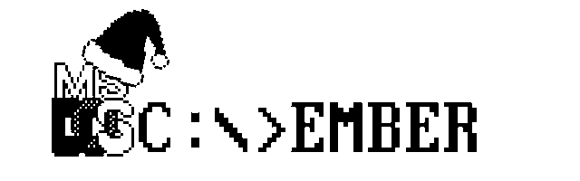
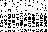
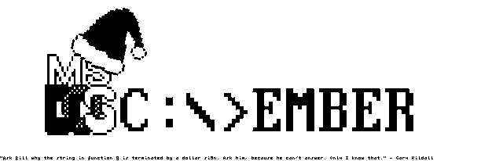

# DOScember Easter Egg Hunt - 2021-12-31
----------------------------------------
In December 2021, my friend, Dave Plonka, under his stage name of
[Dr. Dave's Diversions](https://www.youtube.com/channel/UC_5nmNAlOnFsNO18W3N5cEw)
posted [a video](https://youtu.be/qMtry0vStNc) wherein he reminded
the world of an 'easter egg' he had hidden in an artifact from another 
video he had made for his DOScember 2020 episode. The gauntlet had been
laid down, so I needed to respond.

## Round 1
The first thing to do was to recreate the original png file from the funky
CGA 640x200 memory dump file. I grabbed the [uuencoded file](https://pastebin.com/nCWZmex9) posted in the description of the video. After a quick uudecode
(thanks, '80s!), I had the file.

The next step was to -steal-borrow Dave's encoder script, written in perl,
and attempt to reverse the logic using ImageMagick's perl bindingsto create
a png file from the script. This was my first attempt to use PerlMagick, so
the documentation proved helpful. What was not helpful was that the perl
ImageMagick libraries are not part of the packages maintained in
[Homebrew](https://brew.sh/), so I either needed to download and build
ImageMagick from source, or switch to my Linux machine, which had it all
installed already. I chose the latter.

Regardless, the [first attempt](cgadecode.pl) actually worked just about
perfectly, leaving me with a viable [png file](take1.png).



## Round 2
After looking at the uuencoded file, it was clear that there's more data
there. Watching the video, I knew that the block of 192 bytes after the
first 8000 was "unused memory" in the CGA buffer. A perfect place to hide
easter eggs.

```
$ od -v -Ad -tx1 doscembr.pic
...
0008000 5b f7 f3 bb bf f7 ff b7 ff fb fb ff fb ff 9f ff
0008016 bb ff f1 fb ff bf ff bf fb fd f7 ff ff df bb ff
0008032 ff b1 ff fb f7 f7 bf ff 7f ff ff ff 7f ff ff db
0008048 ff ff ff ff fb fb ff 1f 7f ff fb 7f bf 5f ff 9f
0008064 ff f5 bb df bb ff ff ff ff ff ff ff ff ff ff ff
0008080 f1 b3 f3 bb bf 15 1f b5 3f bb 7b 55 fb 5f 15 57
0008096 bb 55 f1 fb bf b3 71 b5 5b 35 f5 1f 5f 55 bb 57
0008112 fb bd 5f f1 b3 f5 b1 bf 53 75 5b 3f 53 f7 55 7b
0008128 f5 5b 13 7f f5 5b 1f bf 35 51 fb 55 bf ff 1f 55
0008144 71 f3 bb 55 bb ff ff ff ff ff ff ff ff ff ff ff
0008160 f5 ff f3 ff ff ff 1f ff ff ff ff f1 ff ff 3f ff
0008176 ff ff f1 ff ff ff ff ff ff ff ff 1f ff ff ff ff
...
```

Aha! Structure! Let's go back to the file and figure out what it is. First
attempt: text.

```
$ od -v -Ad -c doscembr.pic
...
0008000   [ 367 363 273 277 367 377 267 377 373 373 377 373 377 237 377
0008016 273 377 361 373 377 277 377 277 373 375 367 377 377 337 273 377
0008032 377 261 377 373 367 367 277 377 177 377 377 377 177 377 377 333
0008048 377 377 377 377 373 373 377 037 177 377 373 177 277   _ 377 237
0008064 377 365 273 337 273 377 377 377 377 377 377 377 377 377 377 377
0008080 361 263 363 273 277 025 037 265   ? 273   {   U 373   _ 025   W
0008096 273   U 361 373 277 263   q 265   [   5 365 037   _   U 273   W
0008112 373 275   _ 361 263 365 261 277   S   u   [   ?   S 367   U   {
0008128 365   [ 023 177 365   [ 037 277   5   Q 373   U 277 377 037   U
0008144   q 363 273   U 273 377 377 377 377 377 377 377 377 377 377 377
0008160 365 377 363 377 377 377 037 377 377 377 377 361 377 377   ? 377
0008176 377 377 361 377 377 377 377 377 377 377 377 037 377 377 377 377
...
```

Nope. Must be graphical. Let's see...192 bytes can be turned into what shape
of bitmap? 48x32? Since there are two buffers, let's just stack them together
to get a single 48x64 image.

Instead of just reading and dumping the bytes out, I made another png file
from the extra bits.

48x64 monochrome?

 Nope.

16x64 color?

 Nope.

Somewhere along the way, I noticed that the extra data in the file was
made up of all odd-numbered nibbles (4-bit chunks). That meant that the
low-order bit (1) of each 4-bit pattern was always set, which means that
the graphics should consist of 3-pixel blocks, with a set pixel after them.

768x4 monochrome?

 Nope.

## The final round

Let's take a closer look at the data. It looks like there's a similar looking
structure to the first 80 bytes in the extra chunk as there is in the second
80 bytes. Especially towards the end of the chunk.

```
...
0008064 ff f5 bb df bb ff ff ff ff ff ff ff ff ff ff ff
...
0008144 71 f3 bb 55 bb ff ff ff ff ff ff ff ff ff ff ff
...
```

Hmm...I wonder what would happen if I just made a png file with the
first 160 bytes of the extra data and discarded the last 32?

640x4 monochrome?

 Ah...what's that?

I can almost make out some text there. Does that say Gary Kildall? Why is
it so blocky? (Note -- this is when I found the quote online attributed to
GK and contacted Dave.)

Finally, I realized that I didn't need the extra png file. The extra data
could be read in the same way the rest of the file was. 160 bytes of the
192 could be used to add two rows to the image per pass, then I could add the 32
remaining bytes on the next line. Plus, the interleaving would be right.



